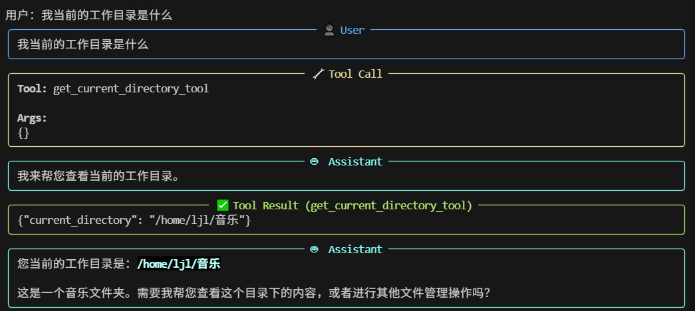
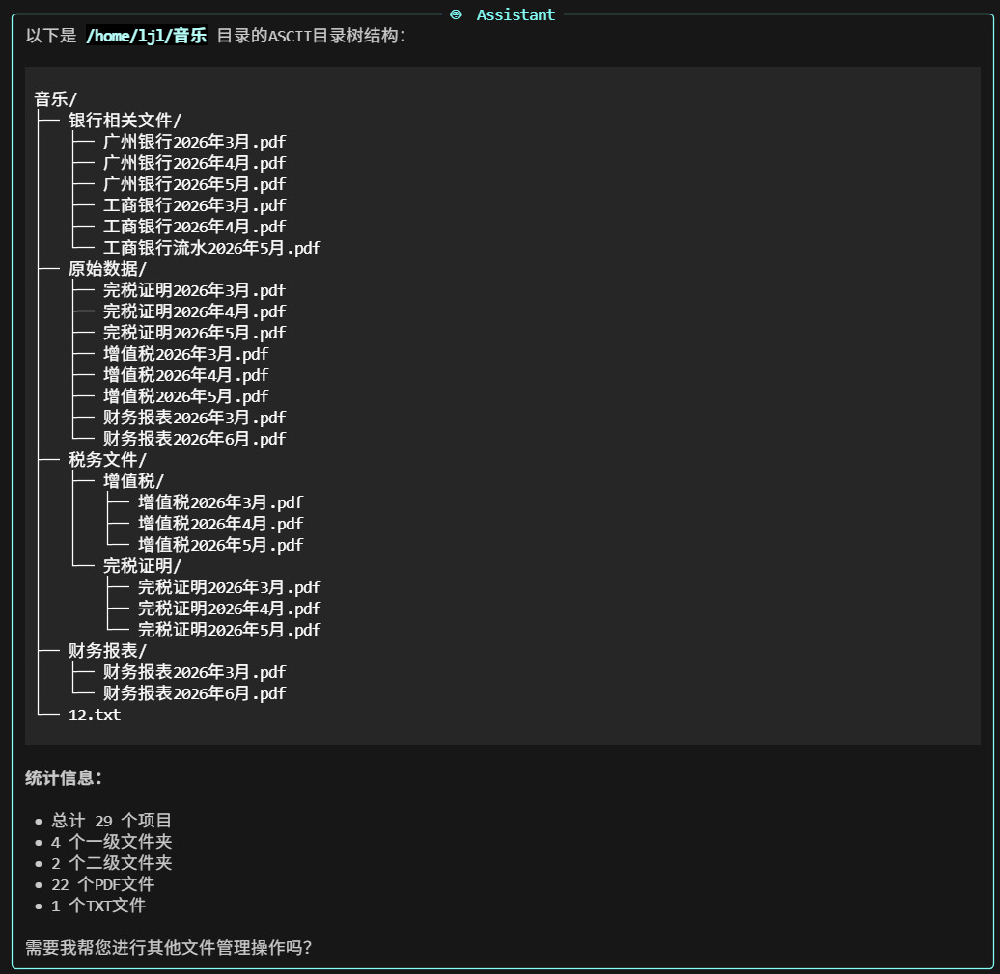

### 工具说明
这是一块基于AI的文件整理助手，用于整理某个文件夹下的杂乱的文件，主要的能力有复制文件、移动文件、删除文件、重命名文件、新建文件夹、列出文件夹内的条目。采用终端运行的方式，你可以与AI进行对话，通过自然语言给它下达指令，就想在跟你的人类助手交流一样，让它帮你整理电脑上的文件。

### 运行方式
#### 安装依赖
`pip install -r requirements.txt`

#### 配置模型
模型配置代码在`llm.py`中，将`.env-example`文件名修改为`.env`，并在其中填入相应的`API_KEY`。
可以根据需要自行修改`llm.py`中的代码更换模型，并在`agent.py`中更改`llm = llm_factory("your_model_name")`，将其中的`your_model_name`替换成你自己设置的名称即可。

#### 使用建议
切换至要整理的文件夹，所有的操作都会在该文件夹内进行。
使用助手整理文件的时候建议在副本上进行，即将要整理的文件夹复制一份副本，在副本上整理，避免破坏原始数据。

例如，如果想整理 `D:\\data` 目录中的文件，建议先将该目录复制一份副本 `D:\\data-copy` ,然后在 `D:\\data-copy` 中启动助手。
启动方式 `python *directory*/file_assistant/agent.py`，其中 `*directory*` 为存放 `file_assistant` 的目录。

#### 使用示例

运行之后可以首先向它提问以下内容。

`你好，你是谁，有哪些功能，可以做哪些事情`
`使用ascii目录树列出我当前工作目录下的内容`

然后你就可以让他辅助你整理文件了，例如 `帮我把跟税务相关的文件整理到一个新的文件中吧`

整理前
```
/home/ljl/音乐                                                                                                 
│  ├── 增值税/                                                                                                    
│  │   ├── 增值税2026年3月.pdf                                                                                    
│  │   ├── 增值税2026年4月.pdf                                                                                    
│  │   └── 增值税2026年5月.pdf                                                                                    
│  ├── 银行相关文件/                                                                                              
│  │   ├── 工商银行2026年3月.pdf                                                                                  
│  │   ├── 工商银行2026年4月.pdf                                                                                  
│  │   ├── 工商银行流水2026年5月.pdf                                                                              
│  │   ├── 广州银行2026年3月.pdf                                                                                  
│  │   ├── 广州银行2026年4月.pdf                                                                                  
│  │   └── 广州银行2026年5月.pdf                                                                                  
│  ├── 原始数据/                                                                                                  
│  │   ├── 完税证明2026年3月.pdf                                                                                  
│  │   ├── 完税证明2026年4月.pdf                                                                                  
│  │   ├── 完税证明2026年5月.pdf                                                                                  
│  │   ├── 增值税2026年3月.pdf                                                                                    
│  │   ├── 增值税2026年4月.pdf                                                                                    
│  │   ├── 增值税2026年5月.pdf                                                                                    
│  │   ├── 财务报表2026年3月.pdf                                                                                  
│  │   └── 财务报表2026年6月.pdf                                                                                  
│  ├── 财务报表/                                                                                                  
│  │   ├── 财务报表2026年3月.pdf                                                                                  
│  │   └── 财务报表2026年6月.pdf                                                                                  
│  ├── 完税证明/                                                                                                  
│  │   ├── 完税证明2026年3月.pdf                                                                                  
│  │   ├── 完税证明2026年4月.pdf                                                                                  
│  │   └── 完税证明2026年5月.pdf                                                                                  
│  └── 12.txt       
```

整理后
```
/home/ljl/音乐                                                                                                 
│  ├── 税务文件/  ⭐ 新建                                                                                         
│  │   ├── 增值税/                                                                                                
│  │   │   ├── 增值税2026年3月.pdf                                                                                
│  │   │   ├── 增值税2026年4月.pdf                                                                                
│  │   │   └── 增值税2026年5月.pdf                                                                                
│  │   └── 完税证明/                                                                                              
│  │       ├── 完税证明2026年3月.pdf                                                                              
│  │       ├── 完税证明2026年4月.pdf                                                                              
│  │       └── 完税证明2026年5月.pdf                                                                              
│  ├── 银行相关文件/                                                                                              
│  │   ├── 工商银行2026年3月.pdf                                                                                  
│  │   ├── 工商银行2026年4月.pdf                                                                                  
│  │   ├── 工商银行流水2026年5月.pdf                                                                              
│  │   ├── 广州银行2026年3月.pdf                                                                                  
│  │   ├── 广州银行2026年4月.pdf                                                                                  
│  │   └── 广州银行2026年5月.pdf                                                                                  
│  ├── 原始数据/                                                                                                  
│  │   ├── 完税证明2026年3月.pdf                                                                                  
│  │   ├── 完税证明2026年4月.pdf                                                                                  
│  │   ├── 完税证明2026年5月.pdf                                                                                  
│  │   ├── 增值税2026年3月.pdf                                                                                    
│  │   ├── 增值税2026年4月.pdf                                                                                    
│  │   ├── 增值税2026年5月.pdf                                                                                    
│  │   ├── 财务报表2026年3月.pdf                                                                                  
│  │   └── 财务报表2026年6月.pdf                                                                                  
│  ├── 财务报表/                                                                                                  
│  │   ├── 财务报表2026年3月.pdf                                                                                  
│  │   └── 财务报表2026年6月.pdf                                                                                  
│  └── 12.txt          
```

#### TIPS
- `使用ascii目录树列出我当前工作目录下的内容`，类似这种提示词会让助手帮你打印目录的内容这样就能很快地了解到当前工作目录有哪些内容了，就不用一个一个文件夹点进去看文件了，建议使用`ascii目录树`这个关键词，否则可能不会打印文件名字前面的线条。

- 不同模型的能力不一样，会导致助手的理解力和执行力的不同，演示使用的模型是阿里云百炼平台的提供的智谱`glm-5`模型。

#### 演示截图


